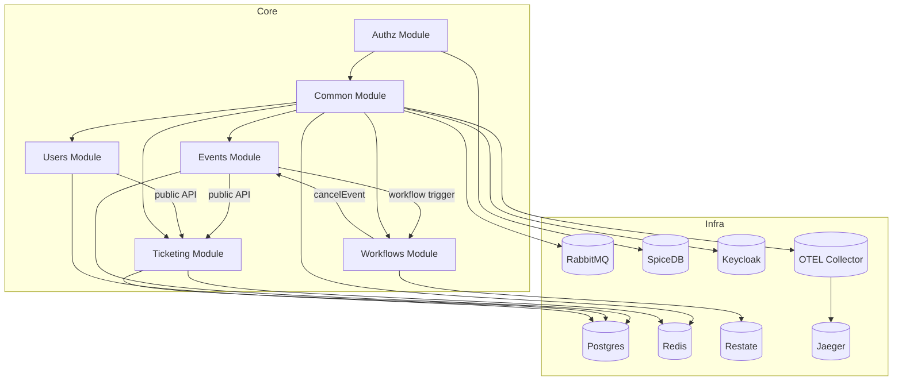

# System Architecture

## High-Level View
The system is a modular monolith with clean architectural layers enforced by ESLint rules. Each module owns its data and exposes a minimal `public` API for cross-module access.

## Major Components
- **Events**: Manages event lifecycle, categories, and ticket types.
- **Ticketing**: Carts, orders, payments, tickets, and inventory.
- **Users**: User registration, profile, roles, and permissions.
- **Workflows**: Restate-based orchestration (cancel event workflow).
- **Authz**: SpiceDB policy management and permission checks.
- **Common**: Shared infrastructure (DB, caching, event bus, tracing, health checks).

## Data Ownership
- Separate PostgreSQL schemas per module: `events`, `users`, `ticketing`.
- Migrations are managed independently per module.

## Integration and Messaging
- Domain events and CQRS in the application layer.
- Outbox/inbox patterns for reliable integration events.
- BullMQ for async processing.
- EventEmitter for in-process domain event dispatch.

## Workflow Orchestration
- Restate workflows run on application startup.
- Cancel Event workflow calls Events public API and executes in a durable context.

## Observability
- OpenTelemetry instrumentation exports traces and logs to Jaeger via the OTEL Collector.
- Global exception filters and health checks support operational diagnostics.

## Dependency Graph (Simplified)

## Runtime Ports (Local)
- API: `http://localhost:3000` (Swagger at `/api`)
- Keycloak: `http://localhost:18080`
- Restate: `http://localhost:8080` (admin `http://localhost:9070`)
- Jaeger UI: `http://localhost:16686`
- RabbitMQ UI: `http://localhost:15672`
- SpiceDB: gRPC `50051`, HTTP `28080`, Playground `http://localhost:13000`
